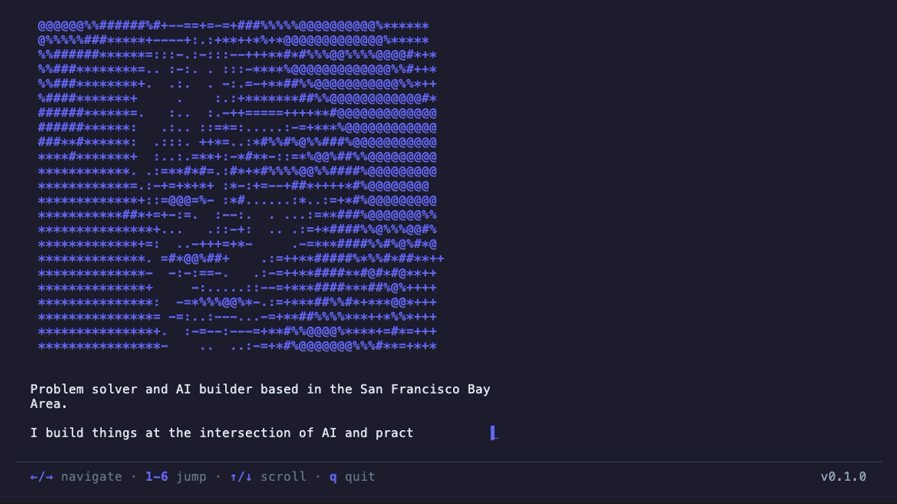

# SSH Portfolio

A terminal-based personal portfolio accessible via SSH. Built with Go and the Charmbracelet ecosystem.

```bash
ssh carl-fung.fly.dev
```



## Features

- 6 pages: About, Projects, Blog, Skills, Experience, Links
- Typing animation with ASCII art portrait
- Scrollable project cards with expandable details
- Markdown blog reader with syntax highlighting
- Keyboard navigation (arrows, vim keys, number jump)
- Dual mode: local TUI or SSH server

## Stack

- [Bubble Tea](https://github.com/charmbracelet/bubbletea) — TUI framework (Elm Architecture)
- [Wish](https://github.com/charmbracelet/wish) — SSH server middleware
- [Lip Gloss](https://github.com/charmbracelet/lipgloss) — Terminal styling
- [Glamour](https://github.com/charmbracelet/glamour) — Markdown rendering

## Run Locally

```bash
go build -o ssh-portfolio .
./ssh-portfolio          # Local TUI
./ssh-portfolio --serve  # SSH server on port 2222
```

## Deploy

Deployed to [Fly.io](https://fly.io) with a persistent volume for SSH host key stability.

```bash
flyctl deploy
```

## Record Demo GIF

Uses [VHS](https://github.com/charmbracelet/vhs) by Charmbracelet:

```bash
vhs demo.tape
```
